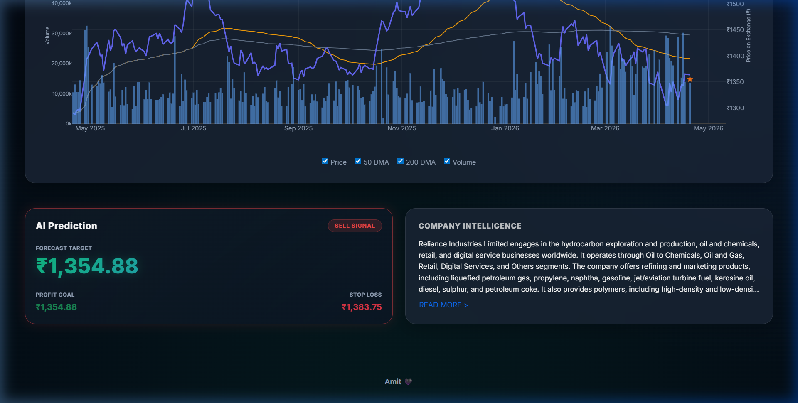

# 📈 StockSense AI

**StockSense AI** is a premium machine learning-based web application designed to predict stock prices with high precision using historical market data and advanced LSTM neural networks. This platform provides traders and investors with actionable intelligence through technical signals, fundamental deep-dives, and professional-grade interactive visualizations.



## 🚀 Project Overview

This project leverages deep learning to forecast equity prices based on historical Open, High, Low, Close, and Volume (OHLCV) data. By integrating technical indicators and sentiment-ready architecture, **StockSense AI** bridges the gap between raw market data and informed decision-making.

## 🎯 Key Features

- **🤖 AI-Powered Neural Forecasting**: Multivariate LSTM (Long Short-Term Memory) model providing next-day predictive projections based on 60-day historical windows.
- **🚥 Actionable Trading Signals**: AI Intelligence HUD computing automated **Strong Buy**, **Buy**, **Hold**, and **Sell** signals with calculated Stop-Loss & Target Profit levels.
- **📈 Professional Charting**: High-performance Plotly charts with real-time toggleable overlays for **50 DMA**, **200 DMA**, and Volume histograms.
- **📊 Fundamental Deep-Dive**: Screener-style dashboard displaying P/E Ratios, TTM EPS, ROCE, ROE, Dividend Yield, and Market Cap.
- **🎨 Modern UX/UI**: Aesthetic interface featuring Glassmorphism, premium typography (Inter), and seamless Dark/Light mode transitions.
- **📂 Dataset Flexibility**: Support for live API polling (Yahoo Finance) and custom proprietary `.csv` or `.xlsx` dataset uploads.

## 🛠️ Technology Stack

- **Backend**: Python, Flask, Gunicorn
- **Data & ML**: NumPy, Pandas, Scikit-learn, TensorFlow/Keras
- **Frontend**: HTML5, CSS3 (Vanilla), JavaScript (ES6+), Bootstrap 5
- **Visuals**: Plotly.js
- **API**: yfinance (Yahoo Finance)

## 📂 Project Structure

```text
StockSense AI/
│── app/                 # Flask Backend & Web Assets
│   ├── static/          # CSS, JS, and Images
│   └── templates/       # HTML Templates
│── src/                 # ML Pipeline (Train, Preprocess, Predict)
│── model/               # Serialized LSTM models and Scalers
│── data/                # Sample datasets
│── screenshots/         # UI Previews for Documentation
│── run.py               # Main Entry Point
│── requirements.txt     # Dependency Manifest
└── README.md            # Documentation
```

## ⚙️ How It Works

1. **Ingestion**: Historical data is fetched via Yahoo Finance or uploaded via CSV.
2. **Preprocessing**: Data is normalized using MinMaxScaler and augmented with technical indicators (RSI, MACD, Bollinger Bands).
3. **Inference**: The pre-trained LSTM model processes the last 60 days of data to predict the next day's close.
4. **Signal Logic**: AI compares the prediction with current price to generate "Buy/Sell" recommendations.
5. **Visualization**: Results are rendered via interactive Plotly charts with dynamic timeframes (1M, 6M, 1Y, 3Y).

## 🧪 Installation & Setup

1️⃣ **Clone the Repository**
```bash
git clone https://github.com/AmitKumarMaurya92/StockSense-AI.git
cd StockSense-AI
```

2️⃣ **Environment Setup**
```bash
python -m venv .venv
# Activate on Windows:
.venv\Scripts\activate
# Activate on Linux/MacOS:
source .venv/bin/activate
```

3️⃣ **Install Dependencies**
```bash
pip install -r requirements.txt
```

4️⃣ **Train/Verify Model**
```bash
python -m src.train_model
```

5️⃣ **Start Application**
```bash
python run.py
```
*Access the dashboard at `http://127.0.0.1:5000`*

## 📈 Results & Performance

- **Predictive Accuracy**: The model is optimized for capturing non-linear market trends.
- **Real-time Comparison**: Interactive candlesticks allow for seamless visual audit of predicted vs actual values.

## 🤝 Contributing

Contributions are welcome! Please fork the repository and submit a pull request for any enhancements or bug fixes.

## 📜 License

This project is licensed under the **MIT License**.

---
**Author**: [Amit Kumar Maurya](https://github.com/AmitKumarMaurya92)
